# AI Emergency Commander Agent Guide

更新日期：2026-06-16

## 1. 项目目标

本项目是一个面向灾害救援的可解释决策 Demo。系统接收统一场景 JSON，依次完成贝叶斯概率推理、区域风险与优先级计算、期望效用任务分配、风险感知 A* 路径规划，以及事件驱动的动态重规划。

### 1.1 端到端流程线

[](docs/assets/agent-workflow.svg)

点击图片可查看 SVG 原图。若编辑器不显示 SVG，可打开 [PNG 版本](docs/assets/agent-workflow.png)；可维护源文件为 [Mermaid 源码](docs/assets/agent-workflow.mmd)。

事件重规划不会重置全部单位。系统先推进正在执行的任务状态，取消受道路坍塌直接影响的地面任务，再只为当前空闲单位重新执行证据推理、路径搜索和任务分配。

### 1.2 各流程使用的算法

| 流程 | 使用的算法或方法 | 实际作用 |
|---|---|---|
| 输入契约校验 | JSON Schema Draft 2020-12 | 检查场景和决策输出的数据结构、类型、必填字段与附加字段。 |
| 场景归一化 | 确定性规则校验、默认值填充、深拷贝 | 检查数值范围、ID 唯一性、节点引用和事件类型，同时避免修改调用方原始输入。 |
| 观测离散化 | 等宽阈值分箱与规则分类 | 用 `1/3`、`2/3` 阈值把连续观测映射为 `low/medium/high`；无人机道路报告使用置信度和风险阈值规则。 |
| 贝叶斯后验推理 | 离散贝叶斯网络精确枚举推理 | 递归枚举未观测变量并归一化联合概率，计算 `trapped_people` 和 `road_passable` 后验；查询前只保留相关节点。 |
| 证据解释 | Leave-one-evidence-out 消融 | 每次移除一项证据重新推理，用后验差值衡量该证据的边际贡献。 |
| CPT 离线学习 | 专家形状 Dirichlet 先验加权计数 | 在专家 CPT 先验上累加带权样本计数并归一化，获得学习 CPT，避免零概率和小样本剧烈波动。 |
| 实验评估 | 5 折交叉验证 | 比较专家 CPT 与学习 CPT 的 Brier、Accuracy、F1、ROC-AUC、校准和缺失证据鲁棒性。 |
| 生命风险与优先级 | 加权线性评分、`[0,1]` 截断、降序排序 | 融合被困后验、火灾、时间紧迫度、道路可通后验等因素，形成可解释区域排序。 |
| 可行性检查 | 硬约束过滤 | 按最低通行概率、最高火灾风险、单位类型和图可达性排除不可执行任务。 |
| 路径规划 | 风险感知 A* | 边代价为 `基础时间 × (1 + 加权道路风险)`；启发函数使用欧氏距离时间下界，无坐标时退化为 Dijkstra。 |
| 路径风险 | 加权线性风险模型 | 融合火灾、损坏、拥堵和次生灾害；无人机使用独立航线图并将路径风险系数缩放为地面单位的 `0.25`。 |
| 期望效用 | 加减权线性效用函数 | 奖励被困概率、生命风险和任务适配度，惩罚预计到达时间、路径风险与单位资源消耗；输出六项贡献分解。 |
| 全局任务分配 | 笛卡尔积穷举与最大总效用搜索 | 枚举小规模 Demo 中各单位的候选任务组合，禁止多个单位同时占用同一区域，选择总效用最高的组合。 |
| 单位执行仿真 | 确定性有限状态机 | 单位在 `idle`、`en_route`、`rescuing`、`returning`、`stranded` 等状态间转换，并按时间推进任务。 |
| 地图位置更新 | 分段线性插值 | 根据路线几何长度和行程完成比例估算单位在路径上的可视化坐标。 |
| 动态重规划 | 时间有序事件循环与滚动重算 | 按事件顺序推进时钟、应用 dot-path 状态变更、失效受影响任务，并为可用单位重新推理和规划。 |
| 随机地图生成 | 带种子的伪随机生成与冗余图构造 | 相同种子生成相同场景；每个灾区同时拥有直达路和独立绕行路，任意一条非医院地面道路失效后仍可从 HQ 到达。 |
| 实时网页推进 | 可序列化阶段状态机与 Streamlit 定时 fragment | 每次刷新只执行一个真实算法阶段或一分钟执行步，允许暂停、恢复和从当前状态注入事件。 |
| 最终结果汇总 | 交付事件记账与结构化聚合 | 只有救援车把人员送达医院才计入救援完成；无人机侦察不会被误计为区域救援。 |

## 2. 当前主要成果

### 2.1 完整可解释决策流水线

- 已实现 11 节点离散贝叶斯网络和精确推理。
- 同一网络结构支持 `fixed` 专家 CPT 与 `learned` 学习 CPT 两种模式。
- 每个区域输出被困概率、道路可通概率、生命风险、优先级和证据边际贡献。
- 输出保留 `run_mode`、`bayesian_model` 和时间线，能够追踪模型来源和重规划过程。

### 2.2 路径、分配与动态仿真

- 地面车辆只使用 `roads`，无人机只使用 `air_routes`。
- 风险感知 A* 同时考虑通行、距离、道路风险、火灾风险和单位能力约束。
- 分配器按期望效用和可行性分派救援车与无人机，并保留候选矩阵、资源成本、六项贡献分解和中文解释。
- 单位状态包含位置、任务、载员、容量和剩余行程。
- 道路坍塌、区域信息变化等事件会更新状态并触发重规划。
- Streamlit 页面可一键生成随机地图并自动运行；地图与九阶段算法轨道并排展示。
- 四类突发事件支持智能选目标和高级手动选择，暂停状态下也可注入，恢复后从 `REPLAN` 继续。
- 最终报告区分侦察和实际送医救援，并可下载 JSON 与 Markdown。

### 2.3 数据契约与工程入口

- 输入和输出分别由 `schemas/scenario.schema.json` 与 `schemas/decision_output.schema.json` 约束。
- 流水线出口会执行运行时输出校验，非法结构不会静默通过。
- 已提供 Python 包、`emergency-commander` CLI、`run.py` 入口和 Streamlit 可视化界面。
- GitHub Actions 会在 push 和 pull request 时安装开发依赖并运行完整测试。

### 2.4 贝叶斯实验与可复现产物

- 使用 2,000 条 USGS 地震记录锚定 `hazard_intensity`。
- 已生成 50,000 条带来源标记的混合样本并完成 5 折交叉验证。
- 学习 CPT 的被困人员 F1 为 `0.4041`，专家 CPT 为 `0.3354`。
- 学习 CPT 的道路可通 ROC-AUC 为 `0.7766`，专家 CPT 为 `0.7740`。
- M3 / 16GB 已记录实验耗时 `92.566s`，Python `tracemalloc` 峰值 `121.632MB`。
- 学习网络、指标、运行时、公开数据元信息和实验报告保存在 `artifacts/full_bayesian_experiment/`。

## 3. 可信边界

- USGS 公开数据只用于锚定灾害强度分布。
- USGS 不包含真实的被困人员和道路通行标签；这两类标签来自有来源标记的贝叶斯祖先仿真。
- 当前学习内容是 CPT 参数，不包括任务分配策略、A* 搜索策略或在线增量学习。
- 该项目是决策支持 Demo，不应被描述为已经在真实救援环境中验证的生产系统。

## 4. 关键文件

| 路径 | 职责 |
|---|---|
| `app.py` | Streamlit 可视化演示入口 |
| `src/emergency_commander/pipeline.py` | 端到端决策和动态重规划 |
| `src/emergency_commander/bayesian_network.py` | 离散贝叶斯网络、精确推理和 CPT 拟合 |
| `src/emergency_commander/expert_cpts.py` | 专家网络结构与 CPT |
| `src/emergency_commander/inference.py` | 区域证据映射、后验和解释 |
| `src/emergency_commander/allocation.py` | 约束任务分配和效用计算 |
| `src/emergency_commander/routing.py` | 地面/空中风险感知 A* |
| `src/emergency_commander/simulation.py` | 单位状态与任务执行仿真 |
| `src/emergency_commander/live_simulation.py` | 可序列化实时仿真阶段、事件注入和最终报告 |
| `src/emergency_commander/random_scenario.py` | 可复现且具单路故障冗余的随机场景生成 |
| `src/emergency_commander/contracts.py` | JSON Schema 运行时校验 |
| `src/emergency_commander/experiment.py` | 混合数据和交叉验证实验 |
| `examples/scenario_input.json` | 默认验收场景 |
| `artifacts/full_bayesian_experiment/` | 学习网络、指标和实验报告 |
| `tests/` | 单元、集成、契约和界面启动测试 |

## 5. Agent 工作约束

1. 修改前先阅读 `README.md`、`HANDOFF.md`、相关模块和对应测试。
2. 保持固定 CPT 与学习 CPT 使用同一网络结构和统一输出契约。
3. 不得混用地面道路图与无人机航线图。
4. 新增或修改输入输出字段时，同步更新 Schema、示例和契约测试。
5. 概率、指标和实验结论必须保留数据来源说明，不得把仿真标签描述为真实救援标签。
6. 修改共享流水线行为时，至少覆盖固定模式、学习模式、事件重规划和输出 Schema。
7. 不提交可再生成的大型 `hybrid_dataset.jsonl`；保留配置、元数据、模型、指标和报告即可复现。
8. 不覆盖工作区中与当前任务无关的已有改动。

## 6. 环境安装

要求 Python 3.11 或更高版本：

```bash
python3 -m venv .venv
.venv/bin/pip install -e '.[dev]'
```

## 7. 验收方法

### 7.1 快速自动验收

```bash
.venv/bin/pytest -q
```

通过标准：命令退出码为 0，当前基线为 `56 passed`。

测试覆盖贝叶斯推理、缺失证据、CPT 学习、JSON 契约、风险路径、任务分配、单位仿真、动态重规划、CLI、实验指标、可视化构造和 Streamlit 启动。

### 7.2 固定 CPT 端到端验收

```bash
.venv/bin/emergency-commander run \
  --scenario examples/scenario_input.json \
  --output /tmp/decision_output_fixed.json \
  --mode fixed
```

通过标准：

- 命令退出码为 0。
- 输出中的 `run_mode` 为 `fixed`。
- 输出中的 `bayesian_model` 为 `expert_cpt`。
- 输出通过 `schemas/decision_output.schema.json` 校验。
- 默认场景生成非空的 `zone_assessment`、`assignments` 和 `timeline`。

### 7.3 学习 CPT 端到端验收

```bash
.venv/bin/emergency-commander run \
  --scenario examples/scenario_input.json \
  --output /tmp/decision_output_learned.json \
  --mode learned \
  --model artifacts/full_bayesian_experiment/learned_network.json
```

通过标准：

- 命令退出码为 0。
- 输出中的 `run_mode` 为 `learned`。
- 输出中的 `bayesian_model` 为 `learned_cpt`。
- 输出通过 `schemas/decision_output.schema.json` 校验。
- 默认场景生成非空的 `zone_assessment`、`assignments` 和 `timeline`。

### 7.4 可视化验收

```bash
.venv/bin/streamlit run app.py
```

浏览器打开 `http://localhost:8501`，依次检查：

- 固定专家 CPT 与学习 CPT 可以切换。
- 点击一次“随机生成并启动”后立即出现随机地图，算法无需第二次点击即可自动运行。
- 实时地图与算法演示并排显示，仿真时钟、单位位置和算法日志自动变化。
- 九阶段轨道明确标注 JSON Schema、精确贝叶斯推理、加权评分、风险感知 A*、线性效用、组合枚举分配、有限状态机、事件重规划和结果聚合。
- 运行中或暂停时可以触发道路坍塌、火势蔓延、新增求救和无人机情报。
- 事件后出现阻断道路或新观测，阶段进入 `REPLAN`；恢复后重规划计数增加并继续执行。
- 最终结果显示结束原因、完成区域、救援人数和事件数，并提供 JSON 与 Markdown 下载。
- 截图证据位于 `output/playwright/live-simulation-initial.png`、`live-simulation-running.png`、`live-simulation-replan.png` 和 `live-simulation-final.png`。

### 7.5 完整实验复现

```bash
.venv/bin/emergency-commander download-public \
  --config config/experiment.yaml \
  --output data/public/usgs_earthquakes.csv \
  --metadata artifacts/full_bayesian_experiment/public_data_metadata.json

.venv/bin/emergency-commander run-experiment \
  --config config/experiment.yaml \
  --public-data data/public/usgs_earthquakes.csv \
  --output-dir artifacts/full_bayesian_experiment
```

通过标准：

- 公开数据元信息包含来源与校验信息。
- 生成 `learned_network.json`、`experiment_metrics.json`、`runtime.json` 和 `experiment_report.md`。
- 指标包含 5 折结果、Brier、Accuracy、F1、ROC-AUC、校准分箱和缺失证据鲁棒性结果。
- 报告明确区分 USGS 强度锚点与仿真目标标签。

## 8. 完成定义

一次功能修改只有在以下条件全部满足时才视为完成：

- 相关自动测试已新增或更新。
- `.venv/bin/pytest -q` 通过。
- 固定和学习模式的相关路径均已检查。
- 输入输出仍满足 JSON Schema。
- README、示例、实验报告或本文件在行为变化时已同步。
- 结果说明没有越过第 3 节定义的可信边界。
